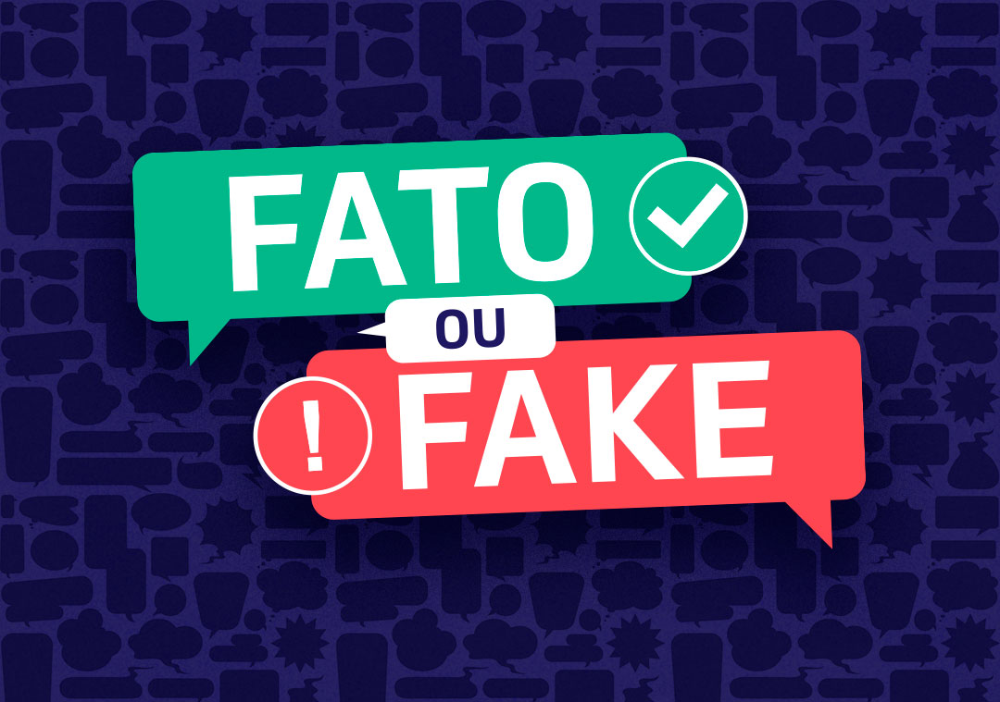

# Fato ou Fake? Vamos Analisar as Informações Eleitorais com Python?

Trago hoje pra você um post bem interessante! Não sei se você sabe mais no dia 16/08/2022 iniciou-se oficialmente a campanha eleitoral de 2022. Acredito que você tenha observado também que os veículos de comunicação (jornais e internet) estão divulgando diariamente estatísticas baseadas nas candidaturas.