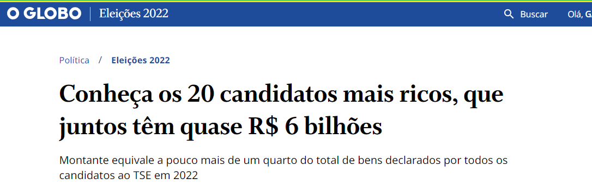
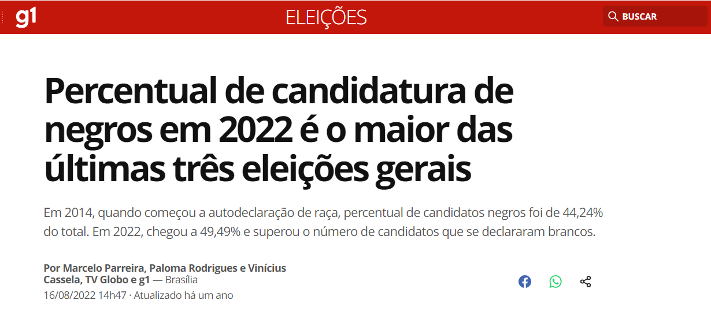
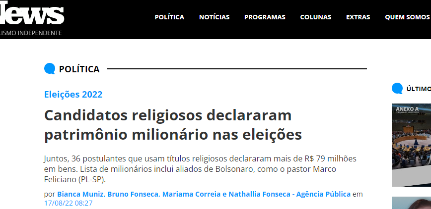
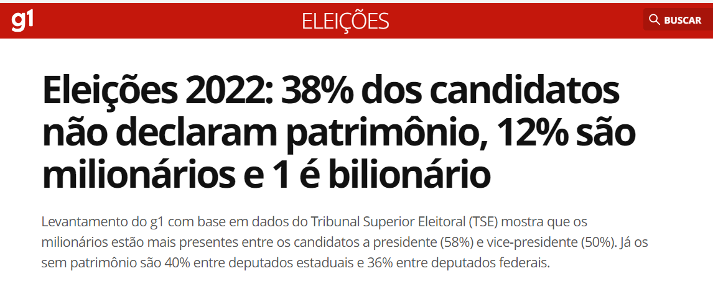

# Regra de Negócio

### 1 - Pontos a serem analisados

* 1.1 - Existem candidatos na Eleição 2022 que possui patrimônio milionário;

* 1.2 - O número de candidatos negros na Eleição de 2022 bateu recorde quando comparado com o número de candidatos inscritos em 2014 e 2018, período que passou a ter a declaração de cor/raça;

* 1.3 - Candidatos religiosos (Pastores, Pastoras, Bispos, Bispas e outros) possuem patrimônios milionários declarado;

* 1.4 - Quase 33% dos candidatos a Governador nas Eleições 2022 não são nativos do estado;

* 1.5 - 38% dos candidatos não declaram patrimônio, 12% são milionários e 1 é bilionários.

### 2 - Onde encontro os arquivos necessários?

* 2.1 - Esses dados são encontrados no diretório [TSE](https://dadosabertos.tse.jus.br/)